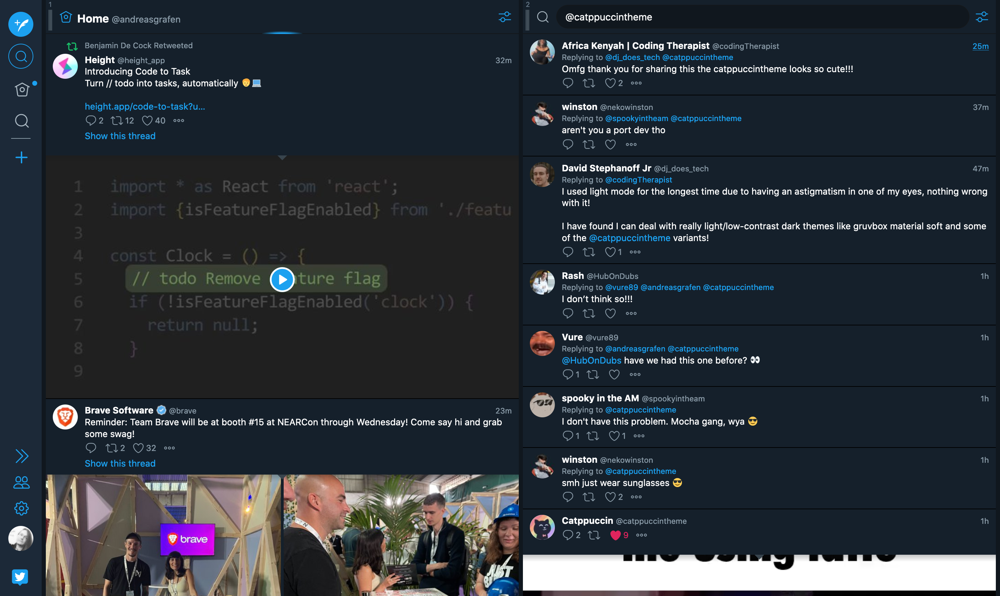

  

# Flexdeck
**A modern Flexbox touch for [Tweetdeck](https://tweetdeck.twitter.com/)**

Flexdeck is a really simple Userstyle to make the Tweetdeck experience just a tad more coherent (opinionated). The column-container is turned into a flexbox container in which empty space will automatically be taken up by adapting the width of the columns. You can also set a default columns width to avoid them getting too narrow on smaller screens or with a lot of columns selected.

 

 

## Install with Stylus

1. Install the Stylus addon for your browser. 
[Firefox](https://addons.mozilla.org/en-GB/firefox/addon/styl-us/) • [Chrome](https://chrome.google.com/webstore/detail/stylus/clngdbkpkpeebahjckkjfobafhncgmne)
2. [Click here to install.](https://github.com/andreasgrafen/flexdeck/raw/main/flexdeck.user.css) 
Alternatively copy the contents of [flexdeck.user.css](flexdeck.user.css) into a new style.

  

--
 

If you *really* like my work you can buy me a coffee to fuel further development. 
While appreciated it's ofc by no means necessary. ♡  

  
